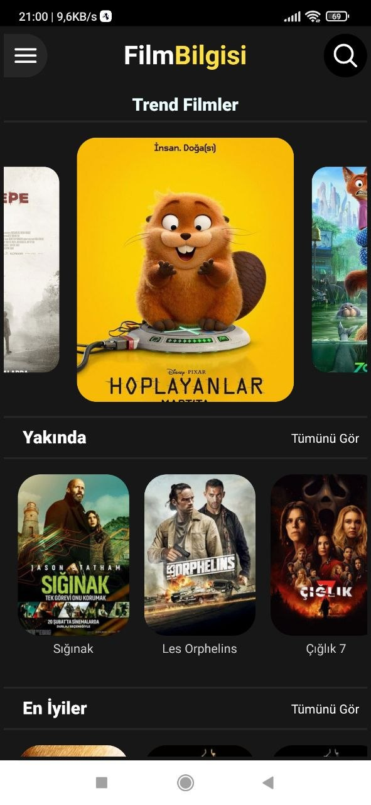
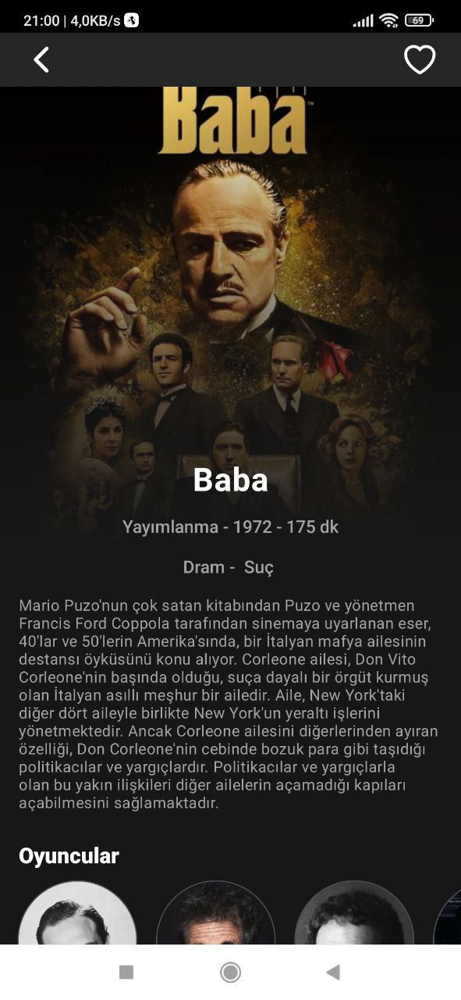
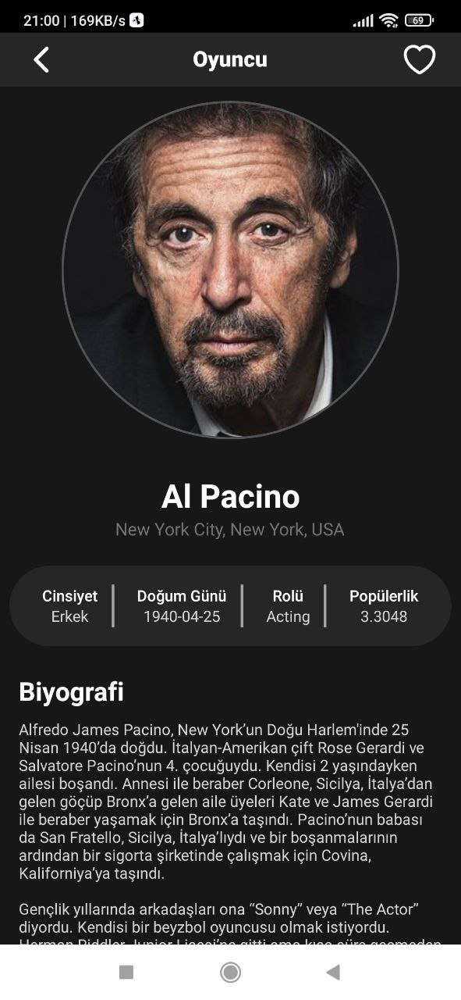
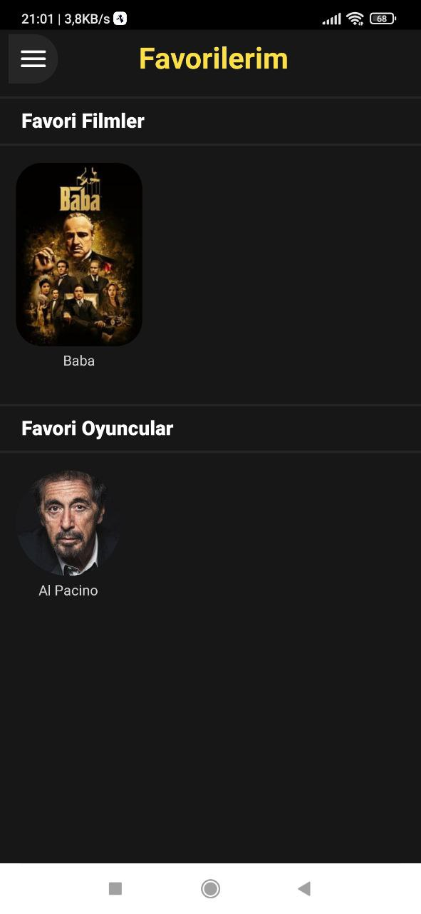
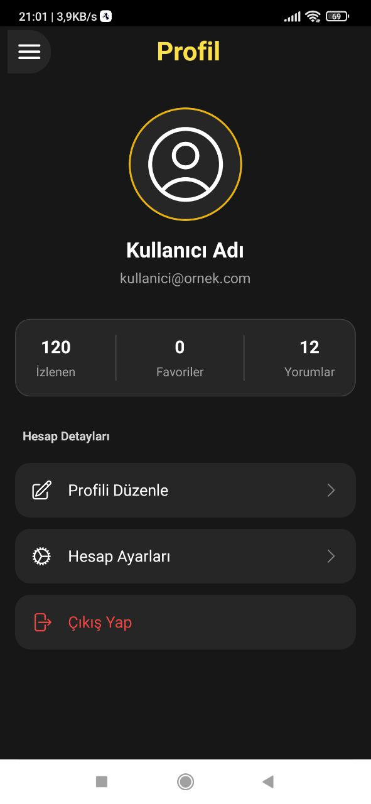
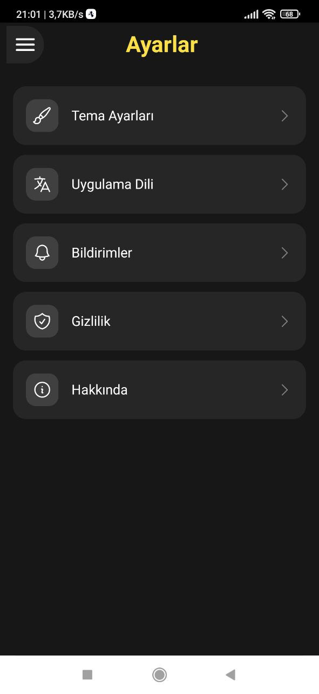
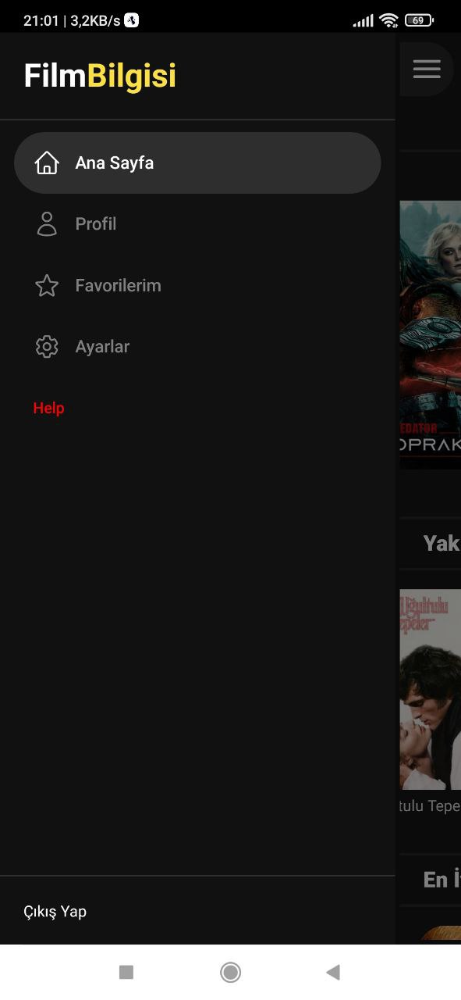

  <h1>🎬 FilmovieTR</h1>
  
A beautiful and modern React Native movie streaming and info application built with <b>Expo</b>, <b>Nativewind (TailwindCSS)</b>, and <b>The Movie Database (TMDB) API</b>.

  

    
    
    
    
    
  

---

## 📸 Ekran Görüntüleri (Screenshots)

  
  
  

 

  
  
  

 

  

---

## 🧩 Özellikler (Features)

- 📽️ **Keşfet:** Popüler, vizyondaki ve en çok oy alan filmleri anlık olarak görüntüleme.
- 🎭 **Oyuncu Detayları:** Sevdiğiniz oyuncuların biyografilerine, oynadıkları rollere ve dizilere erişim.
- ❤️ **Favoriler (Akıllı Hafıza):** `AsyncStorage` ile filmleri ve oyuncuları yerel hafızaya kaydedin; uygulama kapansa da verileriniz silinmesin.
- 👤 **Kullanıcı Profili:** Favori istatistiklerinizi anlık olarak izleyebileceğiniz modern bir profil arayüzü.
- 🔍 **Detaylı Arama:** Gelişmiş arama çubuğu sayesinde binlerce film arasından dilediğinizi saniyeler içinde bulun.
- ⚡️ **Modern Tasarım:** **Nativewind (Tailwind CSS)** ile kusursuz UI ve karanlık tema (Dark Mode) ağırlıklı şık görünüm.

---

## 🚀 Kullanılan Teknolojiler (Tech Stack)

- **UI Framework**: React Native & Expo
- **Styling**: Nativewind (Tailwind CSS)
- **Navigation**: React Navigation (Stack & Drawer)
- **Storage**: AsyncStorage (Kalıcı yapı)
- **Icons & Animation**: React Native Heroicons & Reanimated
- **Data Fetching**: Axios & TMDB API

---

## 🎬 Uygulama Tanıtımı (Video)

**Kısa bir bakış:**
 

---
